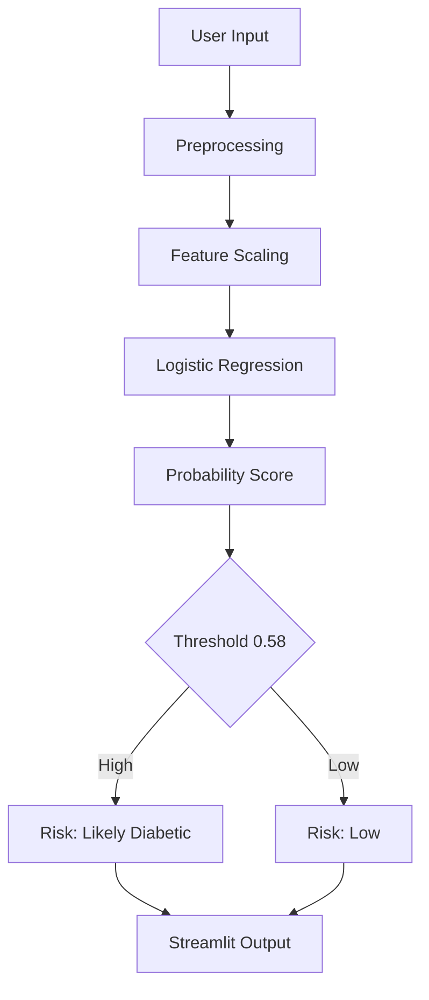

# Diabetes Risk Prediction

A machine learning project that predicts diabetes risk from lifestyle and clinical indicators, with a deployed Streamlit app for interactive assessment.

## Overview

- Goal: early diabetes risk prediction for preventive action
- Focus: reduce false negatives in healthcare screening
- Scope: model comparison, tuning, threshold optimization, deployment

## Tech Stack

| Area | Tools |
| :--- | :--- |
| Models | Logistic Regression, Random Forest, XGBoost, ANN |
| ML/Data | Scikit-learn, TensorFlow, Imbalanced-learn, Pandas, NumPy |
| Visualization | Matplotlib, Seaborn |
| Deployment | Streamlit |
| Dataset | BRFSS 2015 (Kaggle) |

## Dataset

- Source: [BRFSS 2015 Diabetes Health Indicators (Kaggle)](https://www.kaggle.com/datasets/alexteboul/diabetes-health-indicators-dataset)
- Records: ~253,680
- Features: 21
- Target: `Diabetes_binary` (0 = No, 1 = Yes)

## Architecture

If Mermaid does not render in your Markdown viewer, open this README on GitHub.

## Milestones

- Model benchmarking: Logistic Regression, Random Forest, XGBoost, ANN
- Final deployment model: Logistic Regression

## Links

- Live app: [Diabetes Risk Predictor](https://diabetespreidictor.streamlit.app/)
- App implementation details: [Final/README.md](Final/README.md)

## Team

- [Shubham Aggarwal](https://github.com/Shubham-60)
- [Atharva Sharma](https://github.com/alpha-sml)
- [Bhavya Punj](https://github.com/Rravya14)
